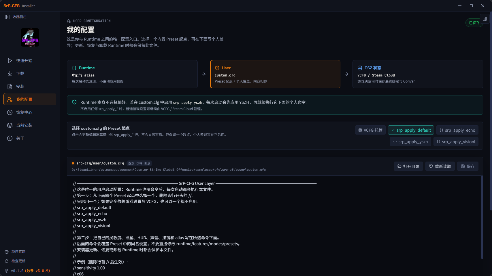
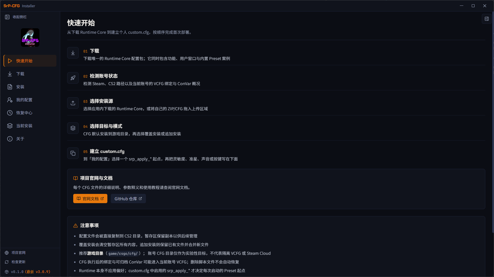
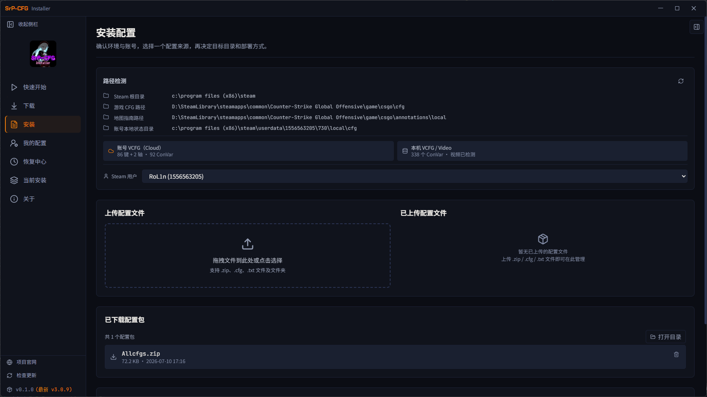
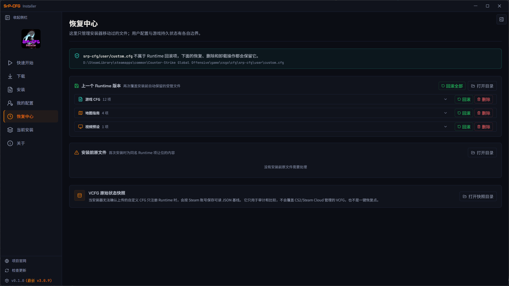
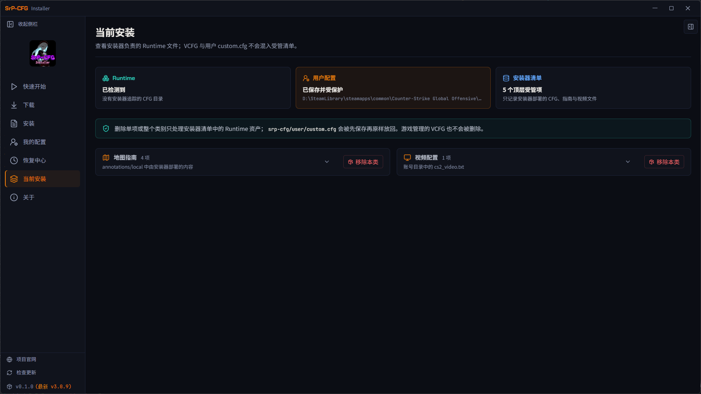
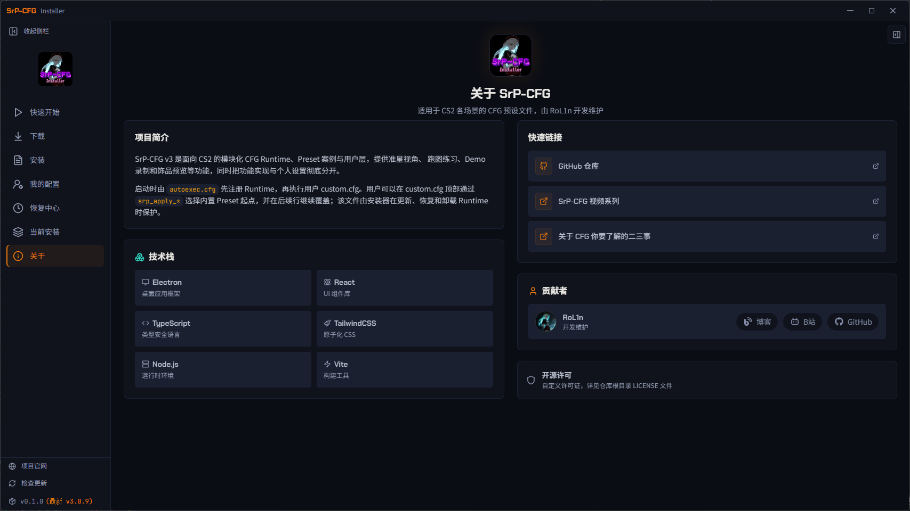

# SrP-CFG for CS2

<p align="center">
  <a href="https://srprolin.top">官方网站</a> ·
  <a href="https://srprolin.top/docs">文档中心</a> ·
  <a href="https://srprolin.top/download">下载</a> ·
  <a href="https://github.com/RolinShmily/SrP-CFG_ForCS2/releases">GitHub Releases</a>
</p>

SrP-CFG v3 是一套面向 Counter-Strike 2 的模块化 CFG Runtime，并提供用于下载、安装、个性化和恢复配置的 Windows 桌面端。它把项目功能、Preset 案例、用户偏好与 CS2 自己管理的 VCFG 状态分开，让配置可以复用、检查和安全更新。

v3 只发行一个 `SrP-CFG_Runtime_Core.zip`：Runtime 负责 alias、Feature 与 Mode，`srp-cfg/user/custom.cfg` 是用户唯一需要维护的个人入口，Default / Echo / YSZH / VisionL 则作为可选 Preset 起点内置其中。

<p align="center">
  
</p>
<p align="center"><sub>在同一个界面中看清 Runtime、用户 custom.cfg 与 CS2 VCFG 的职责边界。</sub></p>

## 开始使用

1. 从[下载页](https://srprolin.top/download)获取桌面端，或直接下载 Runtime Core。
2. 在 Desktop 中检测 Steam / CS2 路径并安装唯一配置包。
3. 打开“我的配置”，保持 VCFG 托管，或选择一个 `srp_apply_*` Preset 起点，再把个人差异写入 `custom.cfg`。

具体命令、模块说明与进阶用法请查看[文档中心](https://srprolin.top/docs)。

## 项目结构

```text
SrP-CFG_ForCS2/
├── default/          # Runtime Core、Preset、用户入口与游戏资源
├── app/
│   ├── desktop/      # Electron + React 桌面端
│   ├── website/      # Astro 官网与文档中心
│   └── shared/       # 共享类型、UI 与内容
├── msi/              # WiX MSI 安装包
└── .github/          # CI、Release 与配置包构建脚本
```

## Desktop 预览

<details>
  <summary><strong>展开查看其余六个界面</strong></summary>
  <br>
  <p align="center">
    
    
  </p>
  <p align="center">
    
    
  </p>
  <p align="center">
    
    
  </p>
</details>

## License

项目许可见 [LICENSE](./LICENSE)。
