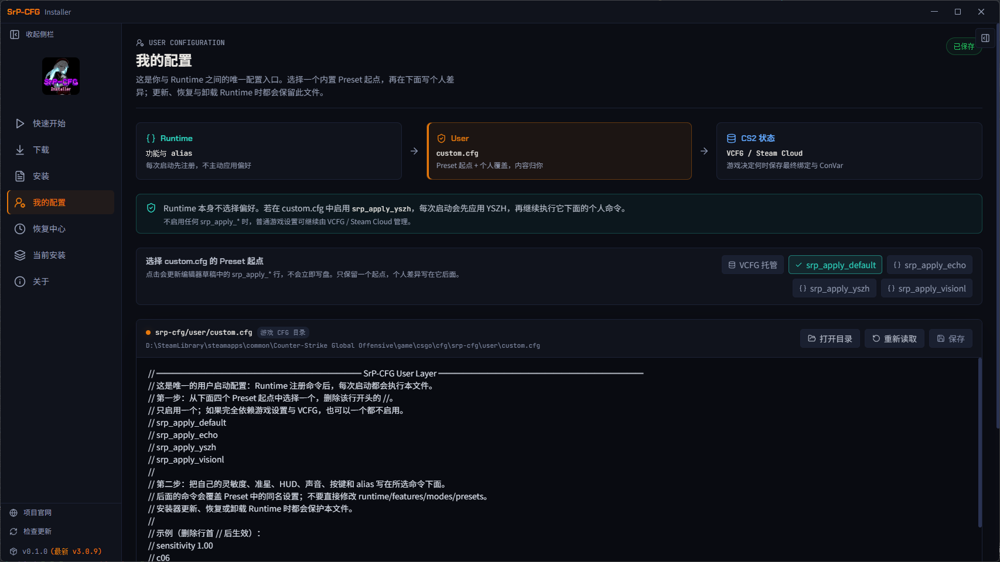
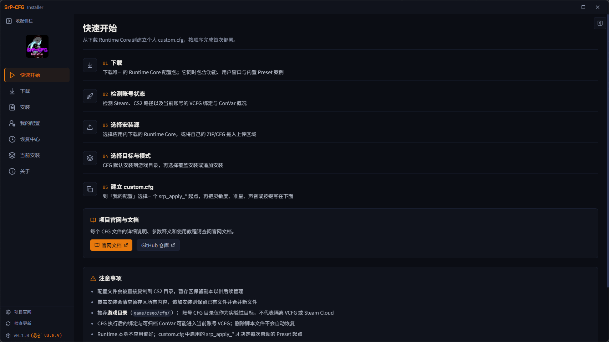
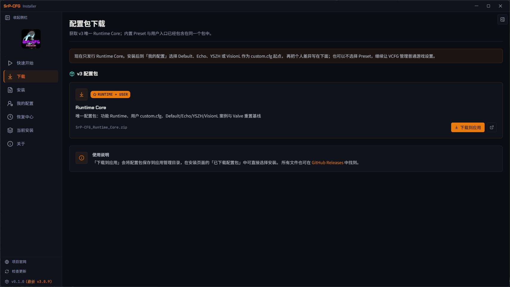
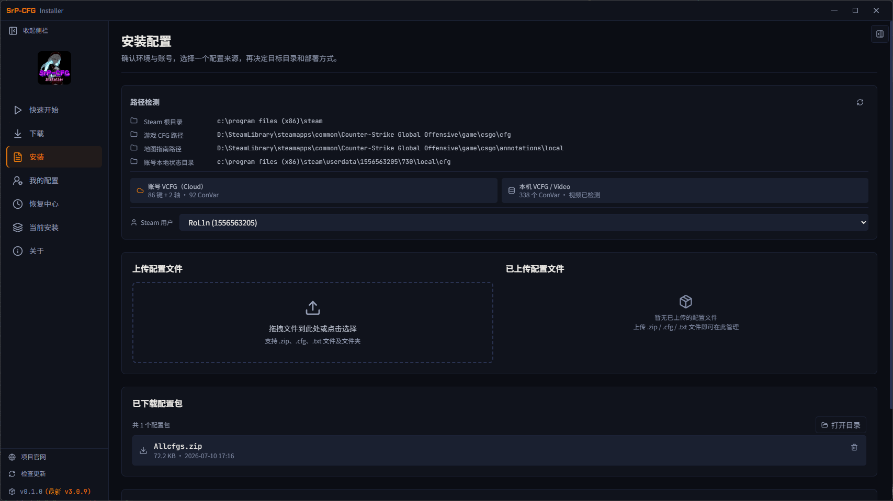
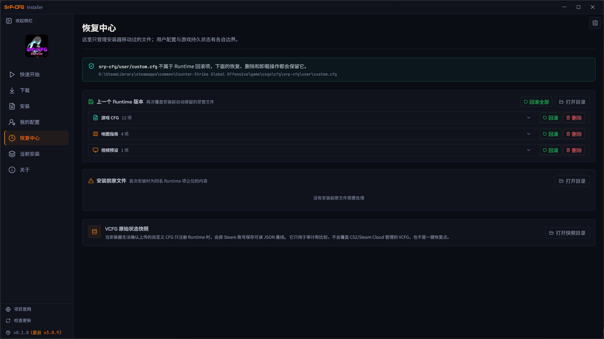
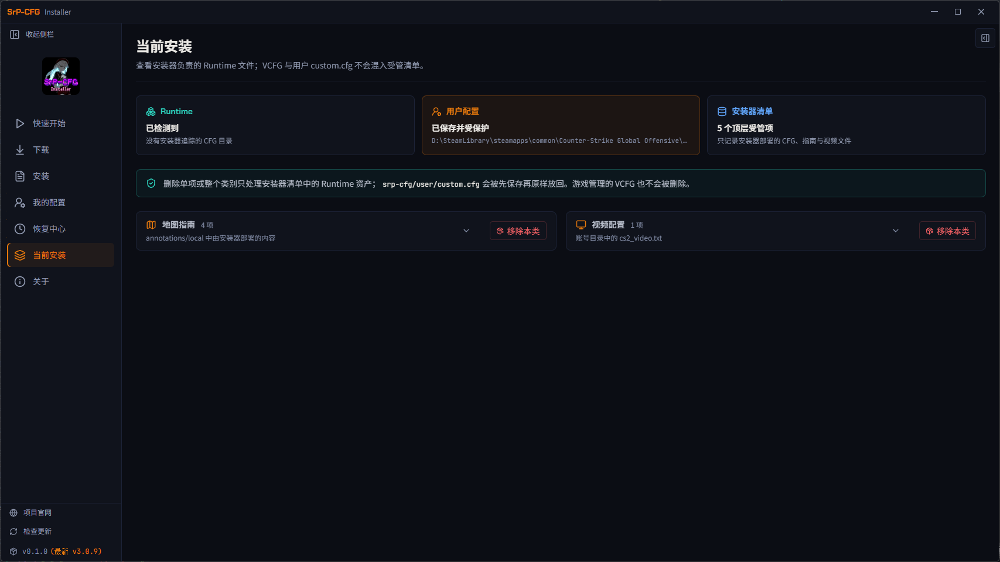
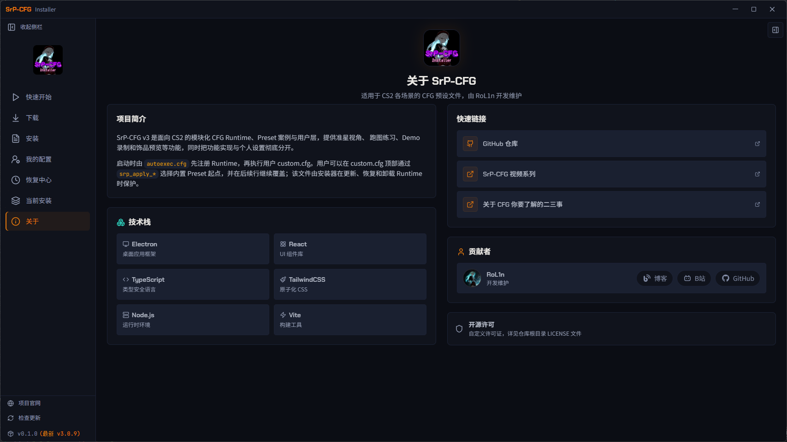

<h1 align="center">SrP-CFG v3</h1>
<h4 align="center">Modular CS2 CFG Runtime, Desktop Installer & Searchable Knowledge Base</h4>
<div align="center">


[](https://github.com/RolinShmily/SrP-CFG_ForCS2)
[](https://github.com/RolinShmily/SrP-CFG_ForCS2)

[](https://github.com/RolinShmily/SrP-CFG_ForCS2/releases)
[](https://deepwiki.com/RolinShmily/SrP-CFG_ForCS2)

<br>

[English](README.md) | [简体中文](README.zh-CN.md)

</div>

## Quick Start

> Install the unified configuration package `SrP-CFG_Runtime_Core.zip`. In-game, type `srp_help` anytime to open the full console help menu.

SrP-CFG v3 separates configuration into four explicit boundaries: **Runtime registers capabilities, Presets provide deterministic baselines, User stores personal overrides, and VCFG is managed by CS2 / Steam Cloud for current persistent state**. Regular users only need to maintain `srp-cfg/user/custom.cfg`, without ever modifying core features or preset files in the repository.

1. Download the MSI / Setup (EXE) installer from the [Download Page](https://cfg.srprolin.top/download), or directly download Runtime Core.
2. Use Desktop to auto-detect Steam, CS2, and active account paths, then install to `game/csgo/cfg/`.
3. Choose a mode in "My Config":
   - **Runtime + VCFG**: Do not enable `srp_apply_*`; standard game settings continue to be managed and persisted by CS2.
   - **Preset + User**: Enable one preset `srp_apply_default / echo / yszh / visionl`, then write personal overrides below.
4. In-game, run `srp_reload` to replay the `Runtime → User` startup chain; run `srp_help` to browse module entries.

| Entrypoint | Description | Overwrites Physical Keybinds |
| :--- | :--- | :---: |
| `srp_help` | Open index for features, modes, presets, and reset commands | No |
| `srp_apply_default / echo / yszh / visionl` | Apply full settings and keymap presets | Yes |
| `srp_practice` / `srp_preview` / `srp_demo` | Apply session-specific settings only | No |
| Corresponding `*_keys` entry | Install workspace keybinds on top of settings | Yes |
| `srp_reset_valve` | Establish an auditable Valve baseline for preferences and keybinds | Yes |
| `srp_reload` | Re-register Runtime and execute `user/custom.cfg` last | Depends on User |

## Scope of Capabilities

- **Runtime Core**: Crosshair / Viewmodel switcher, Auto-view, Knife inspect tricks, Zeus, Practice mode, Skin preview, Map guides, and HLAE Demo mode.
- **Desktop**: Read-only VCFG inspection, `custom.cfg` management, Runtime Install / Update / Rollback / Uninstall while strictly safeguarding user configuration.
- **Documentation Center**: Grouped by Architecture, Installation, Features, Modes, and References; understand override and persistence boundaries before enabling features.
- **Command Center**: Search official CS2 commands via Chinese / English / Pinyin; ConVar cards show default values, engine Min/Max constraints, description scopes, and explicit discrete values.
- **Dual Knowledge Base AI**: Independently indexes SrP-CFG source code structure and official CS2 command data, avoiding confusion between project-specific mechanisms and general ConVar semantics.

### Project Links

- [Official Website](https://cfg.srprolin.top/)
- [Documentation Center](https://cfg.srprolin.top/docs) · [v3 Architecture](https://cfg.srprolin.top/docs/srpcfg-1) · [User Guide](https://cfg.srprolin.top/docs/srpcfg-3)
- [CS2 Command Center](https://cfg.srprolin.top/commands)
- [Download Installer / Runtime Core](https://cfg.srprolin.top/download)
- [GitHub Releases](https://github.com/RolinShmily/SrP-CFG_ForCS2/releases)
- [A Deep Dive into CS2 CFGs (Blog)](https://blog.srprolin.top/posts/srp-cfg/)

## Desktop Interface

<p align="center">
  
</p>

<details>
  <summary><strong>Expand to view additional interfaces</strong></summary>
  <br>
  <p align="center">
    
    
  </p>
  <p align="center">
    
    
  </p>
  <p align="center">
    
    
  </p>
</details>

## Desktop Installer

Download the MSI / Setup installer from [Releases](https://github.com/RolinShmily/SrP-CFG_ForCS2/releases) or the [Download Page](https://cfg.srprolin.top/download) (Built with Tauri v2, NSIS + MSI, bundle size ≤ 20MB). Desktop unifies staging, path detection, deployment, user config, and recovery boundaries into a single auditable interface.

### Features

- Auto-detect Steam, CS2, game CFG, Annotations, Video, and user account CFG paths.
- Read-only analysis of keybindings and preferences from active account VCFG, with one-click CFG command generation into `custom.cfg`.
- Download the unified Runtime Core, or import ZIP, CFG, TXT, and directories.
- Support overwrite and append installation modes, tracking all installer-managed files.
- Directly manage `user/custom.cfg` and `srp_apply_*` baselines in "My Config", with automated VCFG preference extraction.
- Safeguard user custom configurations during Runtime updates, rollbacks, and uninstallation.
- Independently manage previous Runtime backups, pre-install original files, and read-only VCFG snapshots.
- Built-in update checking, real-time logging, and installation audit logs.

## Data & AI Workflows

| Workflow | Trigger | Pipeline | Artifacts |
| :--- | :--- | :--- | :--- |
| CS2 Command Updates | Daily 02:00 UTC / Manual | SteamTracking `commands.txt` + `convars.txt` → Workers AI Chinese Translation (new entries only) → Value Structuring → Vectorize Incremental Sync | `commands.json`, Command Vector Index |
| SrP-CFG Source Index | Push to `config/**` / Manual | CFG Parsing & Validation → Slicing by command, binding, module, and help → BGE-M3 Embedding → Dedicated Vectorize Index | SrP-CFG Source Knowledge Base |
| Website Q&A | User selects knowledge base & queries | Turnstile → Query Embedding → Targeted Vector Index Search → Llama 3.2 Response | Boundary-explicit Chinese / Bilingual answers |

Local validation:

```bash
python .github/scripts/test_command_values.py
pnpm check:config-index
pnpm --filter @srp-cfg/website check
```

### Website AI Assistant Setup (Cloudflare Turnstile)

The AI assistant on the right panel of `/commands` uses Cloudflare Turnstile for verification (Site Key injected into frontend at build time; Secret Key stored only in Worker):

1. Go to [Cloudflare Dashboard → Turnstile](https://dash.cloudflare.com/?to=/:account/turnstile) → **Add site**, add domains `srprolin.top` and `cfg.srprolin.top` to obtain the **Site Key** (public) and **Secret Key** (server-only).
2. Add secrets under GitHub repository **Settings → Secrets and variables → Actions**:
   - `PUBLIC_TURNSTILE_SITE_KEY`: Turnstile Site Key
   - `CLOUDFLARE_TURNSTILE_SECRET`: Turnstile Secret Key
   - `CLOUDFLARE_API_TOKEN`: Cloudflare API Token (requires Workers Scripts:Edit permissions)
   - `CLOUDFLARE_ACCOUNT_ID`: Cloudflare Account ID
3. Trigger the **Deploy Website** workflow (or push changes to `app/website/**`). During build, `PUBLIC_TURNSTILE_SITE_KEY` is injected into the frontend (`vite.config.ts` has `envPrefix` supporting `PUBLIC_`), and the workflow writes the secret into Worker secret `TURNSTILE_SECRET_KEY`.
4. Local development: Copy `app/website/.env.example` to `app/website/.env`, fill in the Site Key, and run `pnpm dev:web`.

> If the UI displays "Turnstile Site Key not configured", the variable was not included in `import.meta.env` during build. Check the env injection in `.github/workflows/deploy-website.yml` and ensure Vite's `envPrefix` includes `PUBLIC_`.

## Project Structure

```text
SrP-CFG_ForCS2/
├── config/                         # Configuration sources for unified Runtime Core
│   ├── autoexec.cfg                # CS2 startup entrypoint
│   ├── annotations/                # Map guide resources
│   ├── video/                      # Video setting resources
│   └── srp-cfg/
│       ├── runtime/                # Persistent aliases & module registrations
│       ├── helps/                  # Console help entrypoints
│       ├── features/               # Resident feature modules
│       ├── modes/                  # Explicit working modes
│       ├── presets/                # Default / Community cases / Valve baselines
│       └── user/custom.cfg         # User-exclusive customization window
├── app/
│   ├── website/                    # Official site & docs (Vite + React Router 7 SSG, 2800+ pre-rendered pages, Velite content pipeline)
│   ├── desktop/                    # Desktop installer (Tauri v2 + React 19, Rust backend + pure logic `core/` crate)
│   └── shared/                     # Shared types, UI components, and content
├── .github/                        # CI, Release, and packaging workflows
└── README.md
```

## Prerequisites & Environment

**General Users:** Download `SrP-CFG_Installer.msi`, `SrP-CFG_Setup_x64.exe`, or `SrP-CFG_Runtime_Core.zip` to get started.

**Developer Environment:**

- [Node.js](https://nodejs.org/) 22+
- [pnpm](https://pnpm.io/) 10+
- [Rust](https://www.rust-lang.org/) (MSVC toolchain, for Tauri desktop builds)
- [Visual Studio Build Tools](https://visualstudio.microsoft.com/) (MSVC C++ toolset)

### Development

```bash
pnpm install
pnpm dev:web
pnpm dev:desktop
```

### Build & Verification

```bash
pnpm build:web
pnpm --filter @srp-cfg/desktop tauri build   # NSIS + MSI installer bundles (src-tauri/target/release/bundle/)

pnpm --filter @srp-cfg/website check
pnpm check:config-index

python .github/scripts/test_command_values.py
python .github/scripts/validate_cfg.py
python .github/scripts/build_packages.py
python .github/scripts/validate_cfg.py --packages
```

## Tech Stack

| Component | Technology |
| :--- | :--- |
| Desktop Installer | Tauri v2 + React 19 (Rust backend, pure logic `core/` crate) |
| Official Website / Docs | Vite + React Router 7 (SSG pre-rendering 2800+ pages) + Velite content pipeline |
| Command Center | Build-time SSG pre-rendering 2785 command details + client-side search |
| AI Assistant | Cloudflare Workers + Vectorize + Workers AI (`/api/chat`) |
| Styling / Components | TailwindCSS v4 + `@srp-cfg/ui` shared component library |
