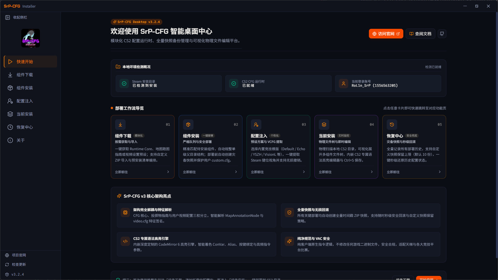
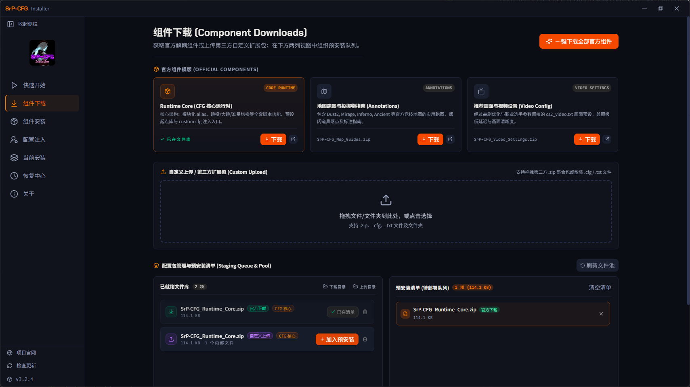
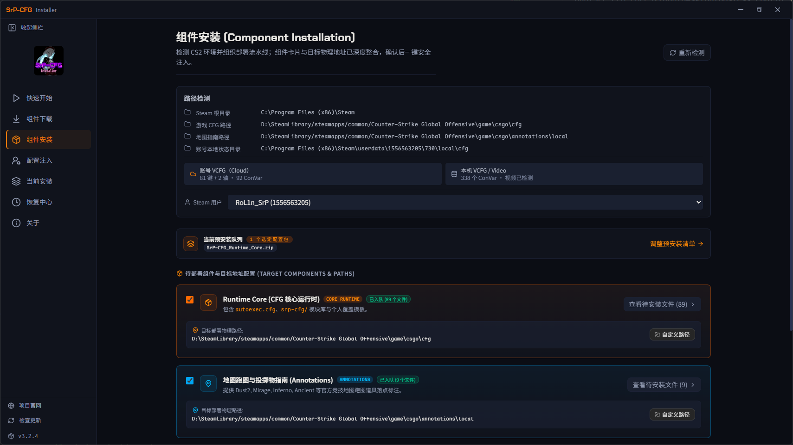
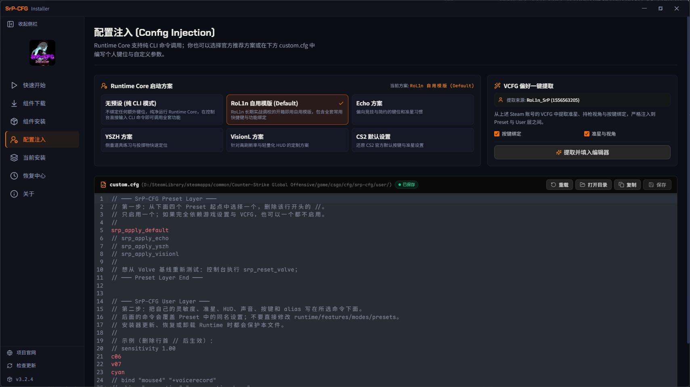
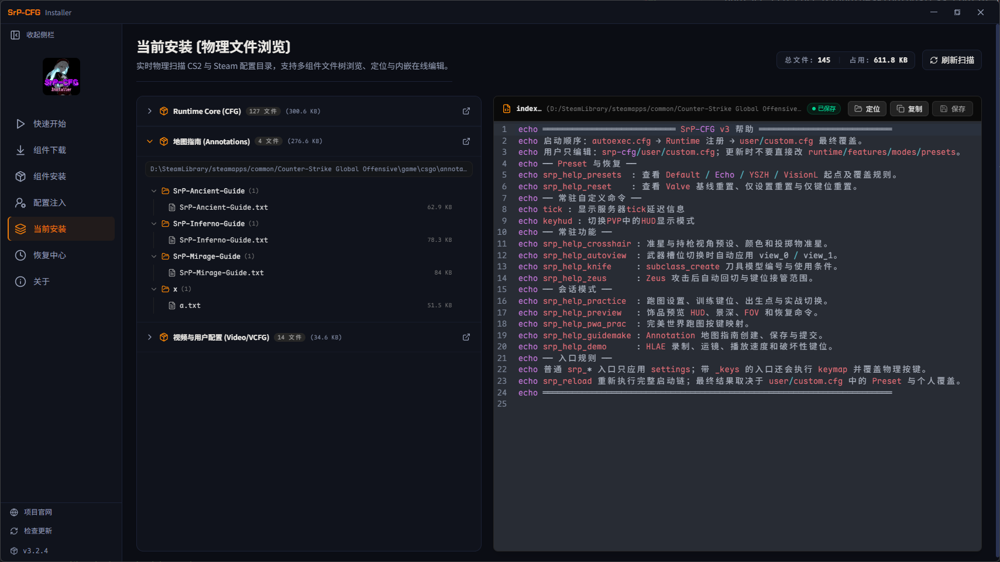
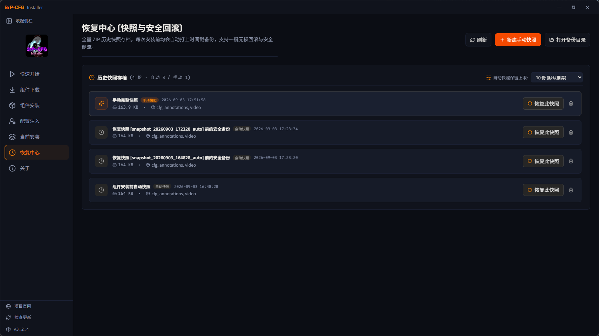
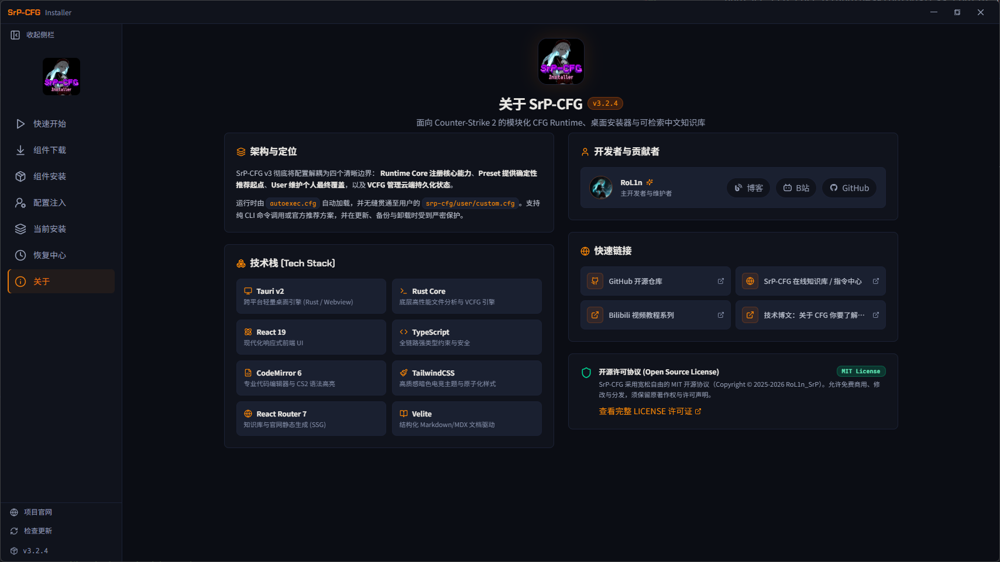

<h1 align="center">SrP-CFG v3</h1>
<h4 align="center">面向 CS2 的模块化 CFG Runtime、高性能桌面套件与可检索知识库</h4>
<div align="center">


[](https://github.com/RolinShmily/SrP-CFG_ForCS2)

[](https://github.com/RolinShmily/SrP-CFG_ForCS2/releases)
[](https://deepwiki.com/RolinShmily/SrP-CFG_ForCS2)

<br>

[English](README.md) | [简体中文](README.zh-CN.md)

</div>

---

## 💡 核心设计理念

> **功能留给运行时，偏好留给你。**

在 Counter-Strike 2 中，Valve 引入了全新的 VCFG 机制管理玩家的按键与设置。传统“大包大揽”的单一 CFG 极易冲掉玩家的个人习惯或被 Steam 云同步覆盖。

SrP-CFG 采用**四层架构模型**与**三大独立解耦套件**设计，确立清晰的职责边界：

- **Layer A · Runtime Core（核心运行时）**：永久只读注册 alias 引擎、Feature 功能模块与 Mode 会话模式，纯原生零污染机制。
- **Layer B · Preset（模版预设）**：提供 RoL1n 自用、Echo、YSZH、VisionL 及 CS2 默认设置等可审计的模版起点。
- **Layer C · User（个人层）**：由玩家维护唯一配置窗口 `user/custom.cfg`，支持一键注入 Steam VCFG 键位与灵敏度偏好，更新时受到**绝对物理保护**。
- **Layer D · VCFG / Cloud（云端状态）**：CS2 引擎原生管理与云同步，桌面端只读分析，绝不暴力覆写或破坏云存档。

```text
CS2 引擎启动
  ↓ 自动加载 Steam Cloud VCFG (本地持久化设置)
  ↓ 执行 autoexec.cfg
  ↓ Layer A: Runtime Core (只读注册 alias / 帮助 / 模式)
  ↓ Layer B: Preset 模版 (可选起点)
  ↓ Layer C: user/custom.cfg (最终个人唯一覆盖，最高优先级生效)
```

---

## 📦 三大独立解耦套件

项目将原本捆绑的内容解耦为三个独立分发的标准组件包，随需取用、按需安装：

| 套件名称 | 部署目标目录 | 说明 |
| :--- | :--- | :--- |
| **`SrP-CFG_Runtime_Core.zip`** | `game/csgo/cfg/` | **核心必选底座**。包含 `autoexec.cfg`、运行时指令引擎、常驻特性、会话模式与预设模版。 |
| **`SrP-CFG_Map_Guides.zip`** | `game/csgo/annotations/` | **官方原生道具标点套件**。基于 CS2 原生 `MapAnnotationNode` KV3 结构，覆盖 Mirage / Inferno / Dust2 / Ancient 等地图全套烟闪火点位。 |
| **`SrP-CFG_Video_Settings.zip`** | `game/csgo/cfg/` | **竞技画质调优套件**。经过职业级实战验证的 `cs2_video.txt` 视频配置预设，针对 144Hz/240Hz+ 竞技显示深度优化。 |

---

## 🚀 快速开始

### 方式一：使用 Desktop 桌面套件（推荐）

1. 从 [下载中心](https://cfg.srprolin.top/download) 或 [GitHub Releases](https://github.com/RolinShmily/SrP-CFG_ForCS2/releases) 下载桌面安装包（`SrP-CFG_Installer.msi` 或 `SrP-CFG_Setup_x64.exe`）。
2. 打开客户端，程序将自动探测 Steam 根目录、CS2 安装路径以及当前活跃账号。
3. 在**组件下载**中一键获取解耦套件（支持国内高速镜像与官方直连），或导入自定义配置包。
4. 在**组件安装**中预览文件差异（新增 / 覆盖 / 保护），勾选所需套件并一键部署。
5. 在**配置注入**中挑选预设模版，一键提取当前 Steam 账号的 VCFG 偏好，并使用内置编辑器微调 `custom.cfg`。

### 方式二：纯手动解压部署（CLI 模式）

1. 下载 `SrP-CFG_Runtime_Core.zip`，解压其内容至 CS2 游戏目录的 `game/csgo/cfg/`。
2. （可选）下载 `SrP-CFG_Map_Guides.zip`，解压至 `game/csgo/annotations/`。
3. （可选）下载 `SrP-CFG_Video_Settings.zip`，解压至 `game/csgo/cfg/`。
4. 启动 CS2，在游戏控制台中运行 `srp_help` 查看所有指令入口。

---

## 🎮 控制台常用指令

| 入口指令 | 作用说明 | 是否覆盖物理键位 |
| :--- | :--- | :---: |
| `srp_help` | 打开功能、会话模式、预设与重置命令完整帮助索引 | 否 |
| `srp_practice` | 激活单机跑图/练枪模式（无限弹药/道具轨迹/快捷买枪/放置 Bot） | 否 |
| `srp_preview` | 激活饰品检视模式 | 否 |
| `srp_demo` | 激活 HLAE / DEMO 观战录像回放增强模式 | 否 |
| `srp_apply_default` | 应用 RoL1n 自用竞技全套设置与键位预设 | 是 |
| `srp_apply_echo` / `yszh` / `visionl` | 应用对应精选社区模版 | 是 |
| `srp_reset_valve` | 建立可审计的 CS2 默认键位与偏好基线 | 是 |
| `srp_reload` | 重新执行 `Runtime → User` 启动链，即时刷新生效 | 取决于 User |

---

## 🖥️ Desktop 桌面套件

Desktop 基于 **Tauri v2 + Rust Core + React 19** 构建（安装包体积 ≤ 20MB，运行时内存占用 < 40MB），提供确定性落地的全流程可视化管理：

<p align="center">
  
</p>

<details>
  <summary><strong>展开查看全部功能页面截图</strong></summary>
  <br>
  <p align="center">
    
    
  </p>
  <p align="center">
    
    
  </p>
  <p align="center">
    
    
  </p>
</details>

### 六大功能亮点

1. **智能环境探测**：自动枚举 Steam 安装路径、CS2 本地物理库、VCFG 用户目录以及 CS2 运行状态探测。
2. **解耦组件与沙盒暂存**：支持官方组件一键双通道下载（直连 / 镜像），或自由拖入第三方 ZIP / CFG 进行内容识别与自动分流。
3. **部署前差异审计**：安装前扫描目标物理路径，直观展示文件差异清单（`[新增]` / `[覆盖]` / `[受保护]`），支持自定义目标路径与 CS2 运行软提醒。
4. **配置注入与 VCFG 提取**：可视化切换模版预设；支持从 Steam Cloud `cs2_user_keys.vcfg` 只读提取键位与灵敏度并注入 `custom.cfg`（附带一键撤销支持）。
5. **CS2 专业代码编辑器**：内置 CodeMirror 6 + 独家 CS2 ConVar / Action 语法高亮引擎，搭配 Maple Mono NF CN 连字等宽字体，支持 `Ctrl+S` 即时保存。
6. **物理文件树与快照灾备**：多根目录（CFG / Annotations / Video）物理文件树实时浏览与编辑；每次部署自动生成完整时间戳 ZIP 灾备快照，支持配置保留上限（默认 10 份）与一键还原。

---

## 🔒 100% Valve Safe · 零注入保证

- **纯原生执行机制**：SrP-CFG 仅依赖 CS2 官方原生的 `+exec` 命令行与标准 `.cfg` / `.txt` 文件，**绝不注入任何 DLL、不篡改游戏内存、不Hook任何引擎调用**。
- **只读 VCFG 审计**：桌面套件仅以只读方式解析 Steam 本地持久化文件，绝不暴力覆写或破坏云存档同步。
- **完整 VAC 安全**：无论是官方匹配、竞技模式还是第三方对战平台，均完全合规安全。

---

## 🌐 官方网站与知识库生态

- **官方网站**：[https://cfg.srprolin.top/](https://cfg.srprolin.top/)
- **文档中心**：[https://cfg.srprolin.top/docs](https://cfg.srprolin.top/docs)（包含架构分层、使用指南、会话模式与排障参考）
- **CS2 指令检索中心**：[https://cfg.srprolin.top/commands](https://cfg.srprolin.top/commands)（收录 2785+ 条官方指令与变量，支持中文、英文与拼音实时模糊搜索，展示默认值与引擎约束）
- **AI 配置助理**：基于 Cloudflare Workers + Vectorize + Workers AI，独立索引 SrP-CFG 源码结构与 CS2 官方指令。

---

## 📁 仓库目录结构

```text
SrP-CFG_ForCS2/
├── config/                         # 源码配置资产库
│   ├── autoexec.cfg                # CS2 启动入口
│   ├── annotations/                # 地图道具标点资源 (KV3 MapAnnotationNode)
│   ├── video/                      # 视频竞技画质预设 (cs2_video.txt)
│   └── srp-cfg/
│       ├── runtime/                # 持久 alias 注册与初始化
│       ├── helps/                  # 控制台帮助说明
│       ├── features/               # 常驻功能模块 (准星/视角/跳投/音效)
│       ├── modes/                  # 显式会话模式 (练枪/跑图/饰品/观战)
│       ├── presets/                # 模版案例库 (RoL1n / Echo / YSZH / CS2 默认)
│       └── user/custom.cfg         # 用户个人定制覆盖窗口
├── app/
│   ├── website/                    # 官网与文档中心 (Vite + React Router 7 SSG, 2800+ 预渲染页面, Velite 管线)
│   ├── desktop/                    # 桌面套件 (Tauri v2 + React 19 + Rust Core 纯逻辑 crate)
│   └── shared/                     # 共享 UI 组件库 (@srp-cfg/ui)、类型定义与媒体资产
├── .github/
│   ├── workflows/                  # CI 自动化构建、校验与发布工作流
│   └── scripts/                    # 配置校验、包解析与打包脚本
└── README.md
```

---

## 🛠️ 本地开发与构建

### 环境要求

- **Node.js**: 22+
- **pnpm**: 10+
- **Rust**: 最新 Stable（MSVC 工具链，用于 Tauri 桌面端构建）
- **Python**: 3.10+ (推荐使用 `uv`)

### 启动开发服务

```bash
# 安装依赖
pnpm install

# 启动官网与文档中心开发预览
pnpm dev:web

# 启动桌面端调试 (基于 Tauri)
pnpm dev:desktop
```

### 构建与测试

```bash
# 构建官网静态 SSG 产物
pnpm build:web

# 构建桌面端安装包 (MSI + NSIS Setup)
pnpm --filter @srp-cfg/desktop tauri build

# 运行 Rust Core 核心逻辑单元测试 (84+ 测试用例)
cargo test -p srp-cfg-core --manifest-path app/desktop/src-tauri/Cargo.toml

# 校验 CFG 语法与解耦打包管线
uv run --with pyyaml python3 .github/scripts/validate_cfg.py --packages
```

---

## 🙏 鸣谢

- [Maple Mono](https://github.com/subframe7536/maple-font) by [@subframe7536](https://github.com/subframe7536) —— 极具美感的开源圆角等宽连字字体（基于 [SIL Open Font License 1.1](https://github.com/subframe7536/maple-font/blob/main/LICENSE) 开源）。本项目桌面套件内置 CS2 代码编辑器与官方文档站均采用 Maple Mono NF CN 作为等宽代码字体支持。

---

## 📄 开源许可证

本项目基于 [MIT License](LICENSE) 协议开源。
Counter-Strike 2 是 Valve Corporation 的注册商标。本项目为独立开源工具，与 Valve 官方无关。
